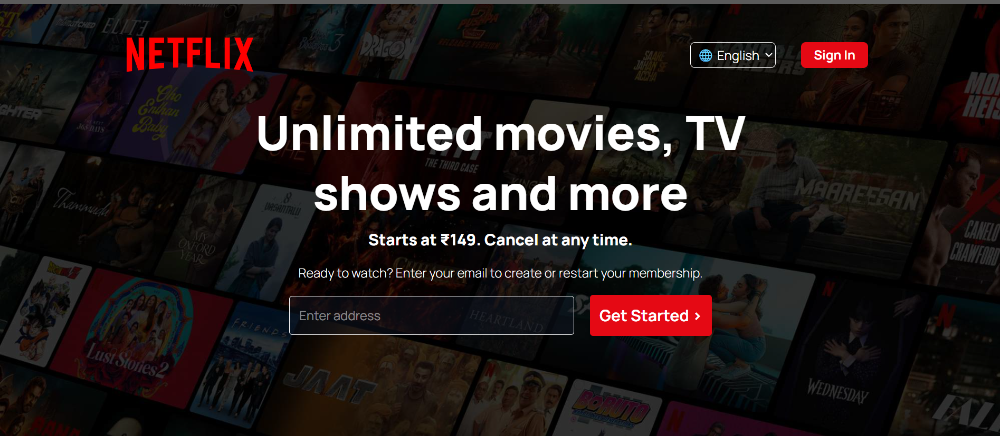

# Netflix Clone

A responsive Netflix-inspired web application built with React and Tailwind CSS.
## Demo
Check out the live demo: [Netflix Clone](https://reelstream-net.netlify.app/)

## Screenshots



## Technologies Used
- Frontend: React, Tailwind CSS
- Deployment: Netlify

## Installation / How to Run Locally
1. Clone the repo:
   ```bash
   git clone https://github.com/your-name/Netflix-clone.git

2. Navigate to the project folder:
   ```bash
    cd netflix-clone

3. Install dependencies:
   ```bash
    npm install

4. Start the development server:
   ```bash
    npm run dev

5. Open your browser and go to:
   ```bash
    http://localhost:5173
